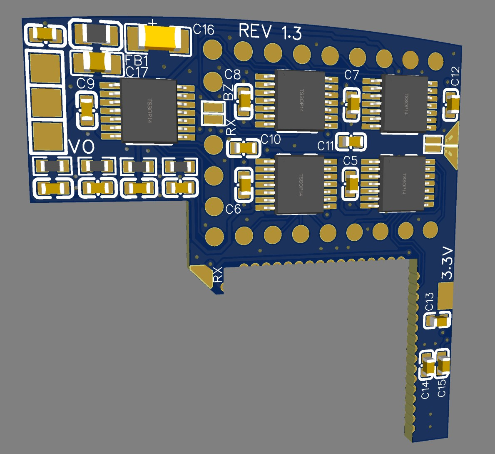
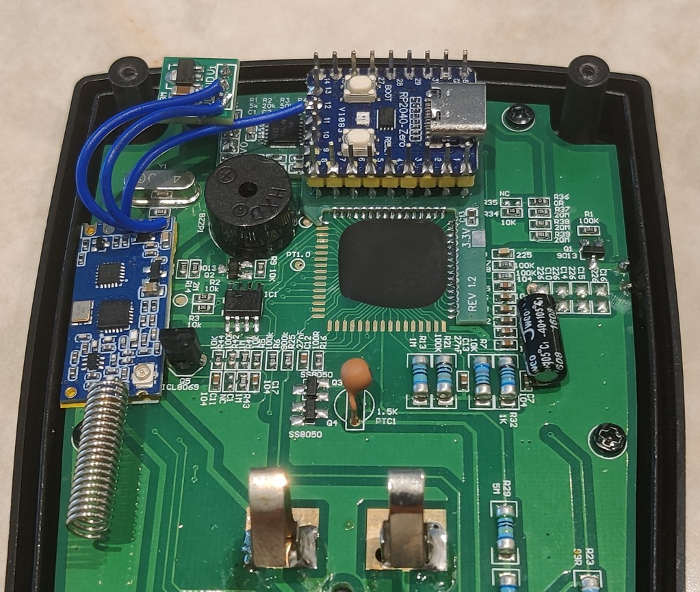

<div align="center">


<br>

**Wireless LCD streaming for the ANENG AN870 multimeter.<br />Straight into OBS, your browser, or anywhere else you need live readings.**

<br>

[](./LICENSE)
[](https://www.youtube.com/@bitsundbolts)
[](https://buymeacoffee.com/bitsundbolts)
[](https://www.patreon.com/BitsUndBolts)

</div>

---

## Table of Contents

- [What is this?](#what-is-this)
- [The Backstory](#the-backstory)
  - [1. The Probe & Segment Mapping](#1-the-probe--segment-mapping)
- [System Architecture](#system-architecture)
  - [2. The Custom PCB & Comparators](#2-the-custom-pcb--comparators)
  - [3. The Transmitter Node (RP2040 Zero)](#3-the-transmitter-node-rp2040-zero)
  - [4. Power Delivery](#4-power-delivery)
  - [5. The Receiver Node & Web UI (ESP32)](#5-the-receiver-node--web-ui-esp32)
- [Wireless Protocol (HC-12)](#wireless-protocol-hc-12)
  - [HC-12 Radio Configuration](#hc-12-radio-configuration)
  - [Meter → ESP32 (Telemetry Packet)](#meter--esp32-telemetry-packet)
  - [ESP32 → Meter (Config Packet)](#esp32--meter-config-packet)
  - [CRC-8 Details](#crc-8-details)
- [LCD Segment Map](#lcd-segment-map)
- [Web Interface](#web-interface)
- [Hardware You'll Need](#hardware-youll-need)
- [Bill of Materials](#bill-of-materials)
- [Repository Layout](#repository-layout)
- [Getting Started](#getting-started)
- [Roadmap / Ideas](#roadmap--ideas)
- [Support This Project](#support-this-project)
- [License](#license)

---

## What is this?

AirMeter is an open-source, wireless hardware + software modification kit that taps directly into the multiplexed LCD glass of an **ANENG AN870** multimeter, decodes every segment in real time, and streams the live reading over a low-power 433 MHz radio link to an ESP32 web server - which then re-renders the exact multimeter display in your browser (or as an OBS overlay) via Server-Sent Events.

No UART hack, no proprietary app, no Bluetooth pairing dance. Just probes on glass traces, a comparator board, and two cheap radio modules.

<p align="center" style="margin: 20px">
  
  <br />
  
  <br />
  
</p>

## The Backstory

This started as a much smaller project: pull data off an ANENG AN870 multimeter and show it as an overlay in OBS for YouTube videos. The obvious path was to find the UART pin on the multimeter, unlock it by patching the settings in the EEPROM, and tap directly into pin 20 of the DTM0660.

Except that Pin 20 does not transmit data - or rather, the chip is sealed under an epoxy blob and there was no connection made from the silicon chip to the pads surrounding the chip with no way to reach it without destroying the chip or the board.

So the only data source left was the LCD itself: **19 physical traces** running to the glass. That's where the real rabbit hole started.

It turns out the AN870 doesn't drive each of its ~60 segments with individual connection wires. Instead it uses a **multiplexed LCD**: a 4×15 matrix (4 COM lines × 15 SEG lines = 60 controllable segments) where each trace is reused across many segments by toggling polarity in sequence.

Probing the glass with an oscilloscope revealed the timing: each COM phase holds for **2 ms** before the driver inverts polarity, which is what prevents DC bias from degrading the liquid crystal over time. A segment is "on" whenever there's a 3V differential between its COM and SEG line - and that 3V can show up as `COM:3V / SEG:0V` or the inverted `COM:0V / SEG:3V`, alternating every cycle.

<p align="center" style="margin: 20px">
  
</p>

### 1. The Probe & Segment Mapping

That explains *how* the display works, but not *which* COM+SEG pair lights up *which* segment. Figuring that out needed an active probe rather than passive observation - which is where the ESP32 decoder script comes in:

```cpp
// Explicitly mapping to your ESP32-C3 SuperMini outer pins
const int COM_PROBE = 5; // Labeled '5' (GPIO5) on the top-right header
const int SEG_PROBE = 6; // Labeled '6' (GPIO6) right below it

int loopCounter = 0;
bool ledState = false;
const int ONBOARD_LED = 8; // GPIO8 is the built-in blue LED on the C3 SuperMini

void setup() {
  pinMode(COM_PROBE, OUTPUT);
  pinMode(SEG_PROBE, OUTPUT);
  pinMode(ONBOARD_LED, OUTPUT);
}

void loop() {
  // Phase 1: 3.3V differential across the display glass
  digitalWrite(COM_PROBE, HIGH);
  digitalWrite(SEG_PROBE, LOW);
  delay(2); // 2ms timing matching your AN870 scope capture

  // Phase 2: Complete inversion to prevent DC screen burn
  digitalWrite(COM_PROBE, LOW);
  digitalWrite(SEG_PROBE, HIGH);
  delay(2); 

  // Heartbeat LED tracker (toggles every 1 second)
  loopCounter++;
  if (loopCounter >= 250) {
    ledState = !ledState;
    digitalWrite(ONBOARD_LED, ledState);
    loopCounter = 0;
  }
}
```

With the two probes, I could map each and every segment on the LCD. One probe goes to COM and the other probe wanders from SEG to SEG line - all 15 of them. Rinse and repeat for the other COM lines.
Once every segment was mapped, the rest of the project was "just" wiring: a comparator board to turn the analog multiplexed wave into clean digital logic, a microcontroller to sample it, a radio link to get the data off the meter, and a web server to put it all somewhere useful.

## System Architecture

```
  ┌─────────────────┐      ┌──────────────────┐       ┌─────────────┐       ┌─────────────────┐      
  │ AN870 LCD glass │ ───▶│ LMV339 Comparator │ ───▶ │ RP2040 Zero │ ───▶ │   HC-12 (TX)    │ 
  │ (4 COM × 15 SEG)│      │  PCB (digitize)  │       │ (sample +   │       │  9600 / C003 /  │ 
  └─────────────────┘      └──────────────────┘       │  frame data)│       │  5dBm / FU1     │     
                                                      └─────────────┘       └─────────────────┘  

   ···▶   ···▶   ···▶    WIRELESS / RADIO TRANSMISSION   ···▶   ···▶   ···▶

   ┌─────────────────┐       ┌────────────────────┐      ┌───────────────────┐
   │   HC-12 (RX)    │ ───▶ │  ESP32-C3 Bridge   │ ───▶ │  Browser / OBS UI │
   │    on ESP32     │       │ decode → SSE → Web │      │ (recreated LCD)   │
   └─────────────────┘       └────────────────────┘      └───────────────────┘

```

### 2. The Custom PCB & Comparators

Reading the multiplexed lines directly from a microcontroller GPIO doesn't work well: the signal swings through **0V, 1V, 2V, and 3V** rather than cleanly between two logic levels, and distinguishing "2V" from "3V" - the actual difference between segment-off and segment-on - is unreliable on a standard digital input.

<p align="center" style="margin: 20px">
  
</p>

The fix is a custom PCB built around **LMV339 comparators**, each referenced to fixed voltage thresholds (~0.5V and ~2.5V) so that the messy analog waveform on each trace gets cleanly digitized into a proper HIGH/LOW signal before it ever reaches a microcontroller pin.

### 3. The Transmitter Node (RP2040 Zero)

[`RP2040_Zero.ino`](./RP2040_Zero/RP2040_Zero.ino) sits right on top of the comparator PCB and does the actual sampling and framing:

- Polls all 4 COM lines every loop iteration; when a COM line goes HIGH, it waits for the signal to settle to the centre of its ~2 ms window before sampling all 15 SEG lines, avoiding edge artifacts.
- Each COM row is **overwritten independently** rather than cleared every cycle, so a single missed multiplexing pass doesn't blank that row - it just keeps the last known-good state, which is the right behaviour for a slowly changing display.
- The buzzer line is handled specially: the DTM0660 drives the buzzer as an AC tone (not a steady DC level), so a single `digitalRead()` would flicker between true/false. A latch with an 80ms hold-off timer smooths this into a stable on/off flag.
- **Sleep detection**: if no COM activity is seen for 10 seconds (the meter's own auto-shutoff kicking in), the RP2040 stops transmitting over the HC-12 to save battery, and resumes automatically the moment COM activity returns.
- Transmits a framed binary packet over HC-12 at a configurable rate (1, 2, 3, 5, or 10 Hz - set from the web UI, persisted to non-volatile memory).
- Also listens for a reverse-direction config packet from the ESP32, letting the web UI remotely change the meter's **channel** (0–31) and **refresh rate** without touching the hardware (which is enclosed inside the multimeter).

### 4. Power Delivery

Since the project is designed to run on **2× AA batteries** (rechargeable 1.2V NiMH cells included), a 3.3V boost converter supplies a steady rail to every component on the transmitter side, regardless of how depleted the cells get.

<p align="center" style="margin: 20px">
  
</p>

### 5. The Receiver Node & Web UI (ESP32)

[`ESP32_C3_SuperMini.ino`](./ESP32_C3_SuperMini/ESP32_C3_SuperMini.ino) is the always-on bridge between the radio link and the network. Its responsibilities:

- **Dual Wi-Fi modes** - boots into a captive-portal Access Point (`AirMeter-Setup` / `airmeter123`) for first-time provisioning, then switches to client mode and is reachable at `airmeter.local` or its DHCP-assigned IP.
- **HC-12 packet decoding** - a non-blocking byte-level state machine parses the framed packets coming from the RP2040, validates them with CRC-8, and unpacks the 60-bit segment string plus buzzer flag and frame-rate index.
- **Server-Sent Events (SSE)** - every decoded frame is pushed immediately to connected browsers via `/events`, with a separate event name per meter channel (`meter-data-<channel>`) so each UI page only subscribes to the meter it cares about.
- **Multi-meter support** - up to **32 meters** (channels 0–31) can be configured, though probably only one should transmit at a time per HC-12 frequency to avoid radios talking over each other. Meters register themselves automatically the first time a packet is seen on their channel.
- **Channel-change cool-off** - when a meter's channel is renamed via the UI, packets already in flight under the old channel number are deliberately dropped for a 5-second window so they don't get mistaken for a brand-new meter re-registering on the old channel.
- **Web UI hosting via LittleFS** - serves the dashboard, meter config page, live view, and file manager straight from flash.
- **OTA updates** - both the compiled ESP32 firmware (`.bin`) and the web UI files themselves can be uploaded and flashed entirely from the browser. No Arduino IDE required for day-to-day updates.
- **File manager** - full CRUD (upload, download, rename, delete) over anything stored on the ESP32's LittleFS partition, including custom multimeter face images (prefixed `mm_*.webp`) that show up automatically in the meter configuration dropdown.

<p align="center" style="margin: 20px">
  
  <br />
  
  <br />
  
  <br />
  
  <br />
  
  <br />
  
  <br />
  
</p>

## Wireless Protocol (HC-12)

### HC-12 Radio Configuration

| Setting | Value | Why |
|---|---|---|
| Baud rate | `9600` | Reliable at this range, plenty of headroom for a 14-byte frame |
| Channel | `C003` | Avoids the crowded default Channel 1 while staying within legal limits |
| Power | `5 dBm` | Not maximum power, but enough range while running off 2× AA batteries |
| Mode | `FU1` | Best balance of fast wake/response time vs. power saving |

[`Arduino_UNO_HT-12.ino`](./Arduino_UNO_HT-12/Arduino_UNO_HT-12.ino) is a small standalone utility (flashed to any spare Arduino Uno) used to program a pair of HC-12 modules into this exact configuration via AT commands, and to read back the current settings for verification. You probably can adapt the code for the ESP32 and use it for configuring the HC-12 module, but be aware that the HC-12 operates from 3.2 - 5.5V. Make sure you're not mixing voltages!

### Meter → ESP32 (Telemetry Packet)

Sent continuously by the RP2040 at the configured frame rate. Total size: **14 bytes**.

| Offset | Field | Size | Description |
|---|---|---|---|
| 0 | `PREAMBLE_1` | 1 byte | `0x55` - sync marker |
| 1 | `PREAMBLE_2` | 1 byte | `0xAA` - sync marker |
| 2 | `LEN` | 1 byte | `0x09` - payload length (also acts as an implicit format tag) |
| 3 | `SEQ` | 1 byte | Rolling sequence number (`0x00`–`0xFF`), increments per packet |
| 4 | `META` | 1 byte | Bits 7–5: FPS index (0–7) · Bits 4–0: meter channel (0–31) |
| 5–6 | `COM0` | 2 bytes | 15 SEG bits for COM0 row. **Bit 15 of byte 5 is repurposed for the buzzer flag** |
| 7–8 | `COM1` | 2 bytes | 15 SEG bits for COM1 row |
| 9–10 | `COM2` | 2 bytes | 15 SEG bits for COM2 row |
| 11–12 | `COM3` | 2 bytes | 15 SEG bits for COM3 row |
| 13 | `CRC8` | 1 byte | CRC-8 (Dallas/Maxim) computed over bytes 2–12 (`LEN` through `COM3` low byte) |

The receiving ESP32 reconstructs a 60-character bit string (`COM0[0..14] + COM1[0..14] + COM2[0..14] + COM3[0..14]`) and ships it to the browser as JSON over SSE:

```json
{"lcd":"000011011111011000000110001000100010111011100000000010001001","buzzer":0,"fpsIdx":1}
```

### ESP32 → Meter (Config Packet)

Sent on-demand when a user changes a meter's channel or refresh rate in the web UI. Total size: **6 bytes**. Note the preamble bytes are intentionally flipped relative to the telemetry direction, so a receiver can immediately tell which direction a packet belongs to even before checking the length byte.

| Offset | Field | Size | Description |
|---|---|---|---|
| 0 | `PREAMBLE_1` | 1 byte | `0xAA` (flipped vs. telemetry direction) |
| 1 | `PREAMBLE_2` | 1 byte | `0x55` |
| 2 | `LEN` | 1 byte | `0x02` - payload length |
| 3 | `CHANNEL` | 1 byte | The **current** channel the target meter is listening on - acts as an address filter so only the intended meter applies the change |
| 4 | `DATA_BYTE` | 1 byte | Bits 7–5: new FPS index (0–7) · Bits 4–0: new channel (0–31) |
| 5 | `CRC8` | 1 byte | CRC-8 (Dallas/Maxim) over bytes 2–4 (`LEN`, `CHANNEL`, `DATA_BYTE`) |

The RP2040 only acts on a config packet if byte 3 matches its **current** channel; it then persists the new channel and FPS index to EEPROM and confirms with a 3-flash LED sequence.

### CRC-8 Details

Both packet types are checked with **CRC-8/MAXIM** (also known as the Dallas/Maxim 1-Wire CRC - the same algorithm used by 1-Wire devices like the DS18B20):

- Polynomial: `x⁸ + x⁵ + x⁴ + 1` (`0x31`, or `0x8C` in reflected/bit-reversed form)
- Initial value: `0x00`
- Input and output reflected (LSB-first)

Because it's a standard, widely implemented algorithm, any existing 1-Wire/Maxim CRC-8 routine - including the ones bundled with common `OneWire` libraries - can validate or generate it without needing project-specific code. The byte ranges covered for each packet type are noted in the tables above.

## LCD Segment Map

Every one of the 60 controllable segments lives at a unique (COM, SEG) coordinate. The 15 SEG lines split into two groups: SEG0–SEG3 and SEG12–SEG14 drive mode/unit icons (READY, AC, REL, battery, and so on), while **SEG4–SEG11 drive the four 7-segment numeric digits** - two segments per COM row, per digit.

For the digit segments, this map uses the standard 7-segment lettering convention:

```
   _A_
  |   |
 F|   |B
  |_G_|
  |   |
 E|   |C
  |___|
    D
```
`A` = top, `B` = upper-right, `C` = lower-right, `D` = bottom, `E` = lower-left, `F` = upper-left, `G` = middle.

### Full COM × SEG reference

`Dx-Y` reads as "Digit x, segment Y" (e.g. `D4-B` = Digit 4's upper-right segment).

| COM | SEG0 | SEG1 | SEG2 | SEG3 | SEG4 | SEG5 | SEG6 | SEG7 | SEG8 | SEG9 | SEG10 | SEG11 | SEG12 | SEG13 | SEG14 |
|---|---|---|---|---|---|---|---|---|---|---|---|---|---|---|---|
| **COM0** | m | Ω | BUZZER | HOLD | D4-B | D4-A | D3-B | D3-A | D2-A | D2-B | D1-B | D1-A | REL | APO | AUTO |
| **COM1** | F | Hz | MAX | DIODE | D4-G | D4-F | D3-G | D3-F | D2-G | D2-F | D1-G | D1-F | NULL | NEG (–) | DC |
| **COM2** | V | n (nano) | M (mega) | °C | D4-C | D4-E | D3-C | D3-E | D2-C | D2-E | D1-C | D1-E | DP-2 | Half-digit "1"¹ | MIN |
| **COM3** | A | µ (micro) | k (kilo) | °F | % | D4-D | DP-2000 | D3-D | DP-200 | D2-D | DP-20 | D1-D | Square Wave | Battery | AC + TRUE RMS² |

¹ The half-digit that turns a 4-digit display into a 19999-count one.
<br/>
² AC and TRUE RMS share this single segment line and always light up together.

### Digit segment quick-lookup (by 7-segment letter)

The four digits each draw their A–G segments from a different mix of COM rows, so this view re-sorts the table above by digit - handy when you're tracing a wire and need to know "which (COM, SEG) pair drives segment B of digit 3?"

| Digit | A | B | C | D | E | F | G |
|---|---|---|---|---|---|---|---|
| **Digit 1** | COM0 / SEG11 | COM0 / SEG10 | COM2 / SEG10 | COM3 / SEG11 | COM2 / SEG11 | COM1 / SEG11 | COM1 / SEG10 |
| **Digit 2** | COM0 / SEG8 | COM0 / SEG9 | COM2 / SEG8 | COM3 / SEG9 | COM2 / SEG9 | COM1 / SEG9 | COM1 / SEG8 |
| **Digit 3** | COM0 / SEG7 | COM0 / SEG6 | COM2 / SEG6 | COM3 / SEG7 | COM2 / SEG7 | COM1 / SEG7 | COM1 / SEG6 |
| **Digit 4** | COM0 / SEG5 | COM0 / SEG4 | COM2 / SEG4 | COM3 / SEG5 | COM2 / SEG5 | COM1 / SEG5 | COM1 / SEG4 |

*Digit numbering reflects the order used while probing the glass - confirm which physical digit is "Digit 1" on your own unit before reusing this map on a different meter.*

### Decimal points

| Label | Location | Likely meaning |
|---|---|---|
| DP-2 | COM2 / SEG12 | Decimal point for the 2.0000 full-scale range |
| DP-20 | COM3 / SEG10 | Decimal point for the 20.000 full-scale range |
| DP-200 | COM3 / SEG8 | Decimal point for the 200.00 full-scale range |
| DP-2000 | COM3 / SEG6 | Decimal point for the 2000.0 full-scale range |

## Web Interface

| Page | Purpose |
|---|---|
| [`index.html`](./ESP32_C3_SuperMini/data/index.html) | Dashboard - active meter cards, firmware/IP/Wi-Fi/storage status, restart & Wi-Fi reset controls |
| [`meterConfig.html`](./ESP32_C3_SuperMini/data/meterConfig.html) | Per-meter configuration - name, face image, channel, refresh rate |
| [`meter.html`](./ESP32_C3_SuperMini/data/meter.html) | Live recreated multimeter display for a single channel, themeable, zoomable, designed to be used directly as an OBS Browser Source |
| [`setup.html`](./ESP32_C3_SuperMini/data/setup.html) | First-boot Wi-Fi provisioning wizard (served while the ESP32 is in AP mode) |
| [`files.html`](./ESP32_C3_SuperMini/data/files.html) | File manager + OTA firmware/UI uploader |
| [`airmeter.css`](./ESP32_C3_SuperMini/data/airmeter.css) | Shared design system used across all pages |
| [`airmeter.js`](./ESP32_C3_SuperMini/data/airmeter.js) | Shared JavaScript file used across all pages |

The live meter view ([`meter.html`](./ESP32_C3_SuperMini/data/meter.html)) ships with a dozen+ built-in color themes (Classic, Amber, Red Alert, Neon Cyan, Glass Dark/Bright, and more), adjustable zoom, and per-meter persistence of both settings - making it drop straight into OBS as a transparent or colored overlay.

## Hardware You'll Need

- 1× ANENG AN870 multimeter (or any multimeter sharing the same DTM0660-driven 4×15 multiplexed LCD)
- 1× RP2040 Zero
- 1× ESP32-C3 SuperMini (receiver side)
- 2× HC-12 433 MHz wireless modules
- 5× LMV339 quad comparators (+custom PCB and SMD components - please see BOM below)
- 1× Arduino Uno (or any AVR board) - only needed temporarily, to program the HC-12 modules
- 3.3V boost converter

## Bill of Materials

| # | Component | Designators | Package | Qty | Value |
|---|-----------|-------------|---------|-----|-------|
| 1 | Capacitor | C2, C4, C5, C6, C7, C8, C9, C10, C11, C12, C14, C18 | C0603 | 12 | 100nF |
| 2 | Capacitor | C17 | C0805 | 1 | 10µF |
| 3 | Capacitor | C16 | C1206 | 1 | 22µF |
| 4 | Ferrite Bead | FB1 | L0805 | 1 | 100Ω @ 100MHz |
| 5 | Capacitor | C1, C3, C13, C15 | C0603 | 4 | 2.2µF |
| 6 | Resistor | R1 | R0603 | 1 | 5kΩ¹ |
| 7 | Resistor | R2 | R0603 | 1 | 20kΩ¹ |
| 8 | Resistor | R3 | R0603 | 1 | 50kΩ² |
| 9 | Resistor | R4 | R0603 | 1 | 6.8kΩ² |
| 10 | Comparator | U1, U2, U3, U4, U5 | TSSOP-14 | 5 | LMV339 |

¹ Voltage Divider (source 3.3V) aim for ~2.5V or more, but below 2.8V<br />
² Voltage Divider (source 3.3V) aim for ~0.5V or less, but above 0.2V

## Repository Layout

```
AirMeter/
├── AirMeter.png                 # Project logo
├── LICENSE                      # MIT license
├── Setup Arduino IDE.docx       # File with instruction of how to set up Arduino IDE 2.3.9+
├── ANENG_AN870/                 # Folder containing research material
├── PCB/
│   ├── Gerber-v1.3.zip          # Gerber Files / Custom PCB
│   ├── BOM.csv                  # Bill Of Materials
│   └── PCB.jpg                  # Comparator PCB photo (add Gerbers/KiCad source + BOM here)
├── Screens/                     # Screenshots used throughout this README
├── RP2040_Zero/
│   └── RP2040_Zero.ino          # Transmitter firmware: sampling, framing, HC-12 TX
├── ESP32_C3_SuperMini/
│   ├── ESP32_C3_SuperMini.ino   # Receiver/bridge firmware: HC-12 RX, Wi-Fi, SSE, OTA
│   └── data/                    # Web UI, flashed to LittleFS
│       ├── index.html           # Dashboard
│       ├── meterConfig.html     # Per-meter configuration
│       ├── meter.html           # Live recreated display (OBS source)
│       ├── setup.html           # First-boot Wi-Fi wizard
│       ├── files.html           # File manager / OTA uploader
│       ├── airmeter.css         # Shared styling
│       └── airmeter.js          # Shared JavaScript file
└── Arduino_UNO_HT-12/
    └── Arduino_UNO_HT-12.ino    # One-time utility to configure the HC-12 modules
```

## Getting Started

**Safety note:** disconnect the test probes from any circuit and remove the battery before opening the meter or soldering anything inside it.

1. **Get the comparator PCB built.** Order the board and SMD parts per the BOM, then solder the five LMV339s and supporting passives.
2. **Map your glass (skip this if you're using a stock AN870).** Use the probing sketch in [The Probe & Segment Mapping](#1-the-probe--segment-mapping) to confirm your unit's COM/SEG layout matches the [LCD Segment Map](#lcd-segment-map) - cheap multimeters sometimes share a glass design across firmware variants, but it's worth verifying before you commit to wiring.
3. **Wire the PCB to the RP2040 Zero**, then flash [`RP2040_Zero.ino`](./RP2040_Zero/RP2040_Zero.ino).
4. **Pre-configure the HC-12 pair** using [`Arduino_UNO_HT-12.ino`](./Arduino_UNO_HT-12/Arduino_UNO_HT-12.ino) so both radios agree on baud rate, channel, power, and mode (see [HC-12 Radio Configuration](#hc-12-radio-configuration)) - do this before final assembly, since the modules are easiest to reach on the bench.
5. **Assemble the transmitter side**: comparator PCB, RP2040, HC-12, and the 3.3V boost converter, all powered from 2× AA cells, mounted inside the multimeter enclosure.
6. **Flash the receiver ESP32-C3 SuperMini** with [`ESP32_C3_SuperMini.ino`](./ESP32_C3_SuperMini/ESP32_C3_SuperMini.ino), then upload the contents of [`data/`](./ESP32_C3_SuperMini/data) to LittleFS so the web UI is served from flash.
7. **Power up the receiver and connect to its `AirMeter-Setup` Wi-Fi AP** (password `airmeter123`), then use the setup wizard to join it to your home network.
8. **Open the dashboard** at `airmeter.local` (or the IP your router assigned it). The meter should auto-register the first time a packet arrives on its channel.
9. **Fine-tune each meter** - name, face image, channel, refresh rate - from `meterConfig.html`.
10. **Add `meter.html` as an OBS Browser Source** (or just open it in any browser) for the live, themeable, zoomable overlay.

## Roadmap / Ideas

- Extend support to other DTM0660-based meters

## Support This Project

If AirMeter saved you a weekend of reverse-engineering (or you just want to see more projects like it), here's where that goes:

- **YouTube** - retro computing and hardware teardown videos: [youtube.com/@bitsundbolts](https://www.youtube.com/@bitsundbolts)
- **Buy Me A Coffee** - one-off or ongoing support: [buymeacoffee.com/bitsundbolts](https://buymeacoffee.com/bitsundbolts)
- **Patreon** - ongoing support: [patreon.com/BitsUndBolts](https://www.patreon.com/BitsUndBolts)

## License

[`MIT`](./LICENSE) - Short and Simple.